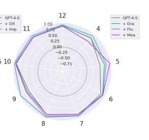

# translation

## Installation
``` 
conda create -n translation python=3.10
conda activate translation

pip install -r requirements.txt
```
## usage
### example
``` 
python translation2.py --model davidkim205/iris-7b
```

## Evaluation

### BLEU 

| TYPE        | Model                            | BLEU | SBLEU |
| ----------- | :------------------------------- | ---- | ----- |
| HuggingFace | facebook/nllb-200-distilled-1.3B | 0.26 | 0.30  |
| HuggingFace | jbochi/madlad400-10b-mt          | 0.29 | 0.38  |
| HuggingFace | Unbabel/TowerInstruct-7B-v0.1    | 0.32 | 0.39  |
| HuggingFace | squarelike/Gugugo-koen-7B-V1.1   | 0.32 | 0.36  |
| Cloud       | Deepl                            | 0.39 | 0.45  |
| Cloud       | Azure                            | 0.40 | 0.49  |
| Cloud       | Google                           | 0.40 | 0.49  |
| HuggingFace | davidkim205/iris-7b(**ours**)    | 0.40 | 0.43  |

* SBLEU: Self-evaluation BLEU

### BLEU by source


| model                          | MTPE | techsci2 | ..   | ..   | ..   |
| ------------------------------ | ---- | -------- | ---- | ---- | ---- |
| ...                            |      |          |      |      |      |
| squarelike/Gugugo-koen-7B-V1.1 | 0.4  | 0.3      |      |      |      |
| davidkim205/iris-7b(**ours**)  | 0.5  | 0.4      |      |      |      |




### BLEU by sentence length

| model                          | ~100 | ~500 | ~1000 | ~1500 | ~2000 |
| ------------------------------ | ---- | ---- | ----- | ----- | ----- |
| ...                            |      |      |       |       |       |
| squarelike/Gugugo-koen-7B-V1.1 | 0.4  | 0.3  | 0.2   | 0.3   | 0.4   |
| davidkim205/iris-7b(**ours**)  | 0.5  | 0.4  | 0.4   | 0.5   | 0.4   |