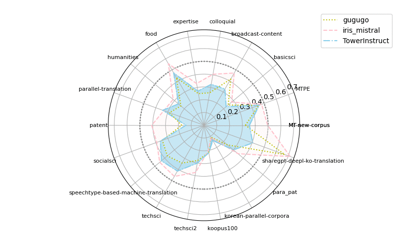

# Iris Translation


Welcome to Iris Translation, a project designed to evaluate Korean-to-English translation models. Our project provides a comprehensive framework for evaluating the Iris model that we have developed.

## Models

- [davidkim205/iris-7b](https://huggingface.co/davidkim205/iris-7b)
- [squarelike/Gugugo-koen-7B-V1.1](https://huggingface.co/squarelike/Gugugo-koen-7B-V1.1)
- [maywell/Synatra-7B-v0.3-Translation](https://huggingface.co/maywell/Synatra-7B-v0.3-Translation)
- [Unbabel/TowerInstruct-7B-v0.1](https://huggingface.co/Unbabel/TowerInstruct-7B-v0.1)
- [jbochi/madlad400-10b-mt](https://huggingface.co/jbochi/madlad400-10b-mt)
- [facebook/mbart-large-50-many-to-many-mmt](https://huggingface.co/facebook/mbart-large-50-many-to-many-mmt)
- [facebook/nllb-200-distilled-1.3B](https://huggingface.co/facebook/nllb-200-distilled-1.3B)

## Installation

``` 
conda create -n translation python=3.10
conda activate translation

pip install -r requirements.txt
```
## Usage

### translate2(Bleu and SBleu)

**executable model**

- davidkim205/iris-7b
- squarelike/Gugugo-koen-7B-V1.1
- maywell/Synatra-7B-v0.3-Translation
- Unbabel/TowerInstruct-7B-v0.1

``` 
python translation2.py --model davidkim205/iris-7b
```

### translate(Bleu), translate_self(SBleu)

**executable model**

- iris_7b
- gugugo
- madlad400
- mbart50
- nllb200
- TowerInstruct
- synatra

```
python translation.py --model iris_7b
python translation_self.py --model iris_7b
```

## Evaluation

```
python evaluate.py results_bleu/
python evaluate.py results_self/
```
output(bleu)
``` 
bleu scores
result_bleu-nllb200.jsonl: 0.26, out_of_range_count=3, duplicate=1
result_bleu-madlad400.jsonl: 0.29, out_of_range_count=6, duplicate=3
result_bleu-TowerInstruct.jsonl: 0.32, out_of_range_count=9, duplicate=1
result_bleu-gugugo.jsonl: 0.32, out_of_range_count=3, duplicate=1
result_bleu-Synatra-7B-v0.3-Translation.jsonl: 0.35, out_of_range_count=2, duplicate=1
result_bleu-deepl.jsonl: 0.39, out_of_range_count=1, duplicate=0
result_bleu-azure.jsonl: 0.40, out_of_range_count=2, duplicate=0
result_bleu-google.jsonl: 0.40, out_of_range_count=3, duplicate=0
result_bleu-iris_7b.jsonl: 0.40, out_of_range_count=3, duplicate=0
```
output(sbleu)

```
bleu scores
result_self-nllb200.jsonl: 0.30, out_of_range_count=1, duplicate=1
result_self-gugugo.jsonl: 0.36, out_of_range_count=1, duplicate=1
result_self-madlad400.jsonl: 0.38, out_of_range_count=3, duplicate=2
result_self-TowerInstruct.jsonl: 0.39, out_of_range_count=3, duplicate=0
result_self-Synatra-7B-v0.3-Translation.jsonl: 0.41, out_of_range_count=2, duplicate=1
result_self-deepl.jsonl: 0.45, out_of_range_count=0, duplicate=0
result_self-azure.jsonl: 0.49, out_of_range_count=0, duplicate=1
result_self-google.jsonl: 0.49, out_of_range_count=0, duplicate=0
result_self-iris_7b.jsonl: 0.43, out_of_range_count=1, duplicate=0
```

### BLEU 

| TYPE        | Model                            | BLEU | SBLEU | Duplicate | Length Exceeds |
| ----------- | :------------------------------- | ---- | ----- | --------- | -------------- |
| HuggingFace | facebook/nllb-200-distilled-1.3B | 0.26 | 0.30  | 1         | 3              |
| HuggingFace | jbochi/madlad400-10b-mt          | 0.29 | 0.38  | 3         | 6              |
| HuggingFace | Unbabel/TowerInstruct-7B-v0.1    | 0.32 | 0.39  | 1         | 9              |
| HuggingFace | squarelike/Gugugo-koen-7B-V1.1   | 0.32 | 0.36  | 1         | 3              |
| Cloud       | deepl                            | 0.39 | 0.45  | 0         | 1              |
| Cloud       | azure                            | 0.40 | 0.49  | 0         | 3              |
| Cloud       | google                           | 0.40 | 0.49  | 0         | 2              |
| HuggingFace | davidkim205/iris-7b(**ours**)    | 0.40 | 0.43  | 0         | 3              |

* SBLEU: Self-evaluation BLEU

### BLEU by source

| Type        | Model                            | Average | MTPE | techsci2 | expertise | humanities | sharegpt-deepl-ko-translation | MT-new-corpus | socialsci | korean-parallel-corpora | parallel-translation | food | techsci | para_pat | speechtype-based-machine-translation | koopus100 | basicsci | broadcast-content | patent | colloquial |
| ----------- | :------------------------------- | ------- | ---: | -------: | --------: | ---------: | ----------------------------: | ------------: | --------: | ----------------------: | -------------------: | ---: | ------: | -------: | -----------------------------------: | --------: | -------: | ----------------: | -----: | ---------: |
| HuggingFace | facebook/nllb-200-distilled-1.3B | 0.26    | 0.44 |     0.28 |      0.16 |       0.23 |                          0.44 |          0.34 |      0.27 |                     0.1 |                 0.23 | 0.37 |    0.28 |     0.19 |                                 0.29 |      0.23 |     0.15 |              0.33 |   0.09 |       0.29 |
| HuggingFace | jbochi/madlad400-10b-mt          | 0.29    | 0.45 |     0.29 |       0.2 |       0.29 |                           0.4 |          0.36 |      0.39 |                    0.12 |                 0.22 | 0.46 |     0.3 |     0.23 |                                 0.48 |      0.23 |     0.19 |              0.36 |   0.01 |       0.33 |
| HuggingFace | Unbabel/TowerInstruct-7B-v0.1    | 0.32    | 0.46 |     0.33 |      0.28 |       0.27 |                           0.3 |          0.39 |      0.37 |                    0.14 |                 0.35 | 0.47 |    0.39 |     0.29 |                                 0.41 |      0.21 |     0.22 |              0.36 |   0.15 |       0.33 |
| HuggingFace | squarelike/Gugugo-koen-7B-V1.1   | 0.32    | 0.46 |     0.27 |      0.28 |       0.22 |                          0.66 |          0.33 |      0.36 |                     0.1 |                 0.29 | 0.45 |    0.34 |     0.24 |                                 0.42 |      0.22 |     0.23 |              0.42 |    0.2 |       0.26 |
| Cloud       | deepl                            | 0.39    | 0.59 |     0.33 |      0.31 |       0.32 |                           0.7 |          0.48 |      0.38 |                    0.14 |                 0.38 | 0.55 |    0.41 |     0.33 |                                 0.48 |      0.24 |     0.28 |              0.42 |   0.37 |       0.36 |
| Cloud       | azure                            | 0.40    | 0.57 |     0.36 |      0.35 |       0.29 |                          0.63 |          0.46 |      0.39 |                    0.16 |                 0.38 | 0.56 |    0.39 |     0.33 |                                 0.54 |      0.22 |     0.29 |              0.52 |   0.35 |       0.41 |
| Cloud       | google                           | 0.40    | 0.62 |     0.39 |      0.32 |       0.32 |                           0.6 |          0.45 |      0.45 |                    0.14 |                 0.38 | 0.59 |    0.43 |     0.34 |                                 0.45 |      0.22 |     0.28 |              0.47 |   0.39 |       0.36 |
| HuggingFace | davidkim205/iris-7b(**ours**)    | 0.40    | 0.49 |     0.37 |      0.34 |       0.31 |                          0.72 |          0.48 |      0.43 |                    0.11 |                 0.33 | 0.56 |    0.46 |     0.34 |                                 0.43 |       0.2 |      0.3 |              0.47 |   0.41 |        0.4 |




### BLEU by sentence length

| Type        | Model                            | Average | ~100(111) | ~500(61) | ~1000(6) | ~1500(2) |
| ----------- | :------------------------------- | ------- | --------: | -------: | -------: | -------: |
| HuggingFace | facebook/nllb-200-distilled-1.3B | 0.26    |      0.28 |     0.25 |     0.16 |     0.06 |
| HuggingFace | jbochi/madlad400-10b-mt          | 0.29    |      0.32 |     0.27 |     0.09 |     0.01 |
| HuggingFace | Unbabel/TowerInstruct-7B-v0.1    | 0.32    |      0.33 |     0.31 |     0.21 |     0.19 |
| HuggingFace | squarelike/Gugugo-koen-7B-V1.1   | 0.32    |      0.33 |      0.3 |     0.31 |     0.21 |
| Cloud       | deepl                            | 0.39    |      0.39 |      0.4 |     0.43 |     0.39 |
| Cloud       | azure                            | 0.40    |      0.41 |     0.39 |     0.36 |     0.33 |
| Cloud       | google                           | 0.40    |       0.4 |      0.4 |     0.43 |      0.4 |
| HuggingFace | davidkim205/iris-7b(**ours**)    | 0.40    |      0.39 |     0.41 |     0.54 |     0.34 |

## test dataset info
| src                                        | ratio | length |
|--------------------------------------------| ----- | ------ |
| aihub-MTPE                                 | 5.56% | 10/180 |
| aihub-techsci2                             | 5.56% | 10/180 |
| aihub-expertise                            | 5.56% | 10/180 |
| aihub-humanities                           | 5.56% | 10/180 |
| sharegpt-deepl-ko-translation              | 5.56% | 10/180 |
| aihub-MT-new-corpus                        | 5.56% | 10/180 |
| aihub-socialsci                            | 5.56% | 10/180 |
| korean-parallel-corpora                    | 5.56% | 10/180 |
| aihub-parallel-translation                 | 5.56% | 10/180 |
| aihub-food                                 | 5.56% | 10/180 |
| aihub-techsci                              | 5.56% | 10/180 |
| para_pat                                   | 5.56% | 10/180 |
| aihub-speechtype-based-machine-translation | 5.56% | 10/180 |
| koopus100                                  | 5.56% | 10/180 |
| aihub-basicsci                             | 5.56% | 10/180 |
| aihub-broadcast-content                    | 5.56% | 10/180 |
| aihub-patent                               | 5.56% | 10/180 |
| aihub-colloquial                           | 5.56% | 10/180 |